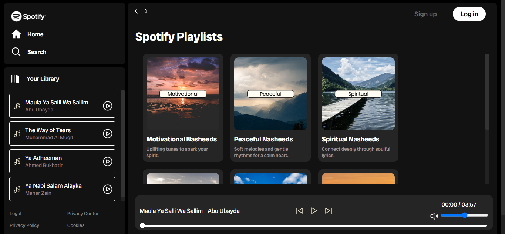

# Spotify UI Clone
## 🚀 Overview
A sleek, responsive **Spotify-inspired web music player** built with HTML, CSS, and JavaScript. This UI clone mimics the core functionality of Spotify — including album browsing, dynamic track lists, audio playback, volume control, and an interactive UI.

 

## 🚀 Screenshots

 

## 🚀 Features
- Spotify-like UI with album covers, play buttons, and sidebars
- Dynamic album & track loading from info.json and song folders
- Track controls — play, pause, next, previous
- Progress bar with seeking functionality
- Volume control and mute toggle
- Mobile-responsive design with hamburger menu

 

## 🚀 Tech Stack
- **HTML:** Page structure
- **CSS:** Styling, responsive layout
- **JavaScript:** Dynamic functionality & logic
- **JSON:** Album metadata (info.json)

 

## 🚀 Learnings
This project helped in practicing:
 
&emsp; ⮞ DOM manipulation
 
&emsp; ⮞ Audio APIs
 
&emsp; ⮞ Event-driven programming
 
&emsp; ⮞ Responsive design
 
&emsp; ⮞ JSON integration for dynamic content

 

## 🚀 Deployment
The app is deployed on <b>Netlify</b> and can be accessed via:
 
https://neftlix-replica.netlify.app/

 

## 🚀 Contact
- LinkedIn: www.linkedin.com/in/ibadhussain